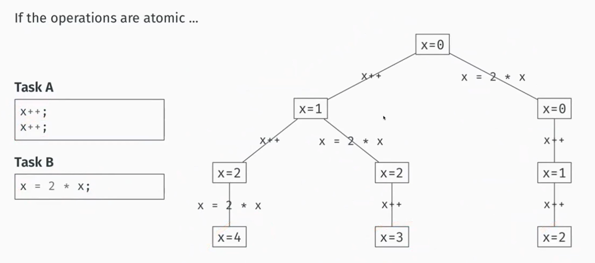
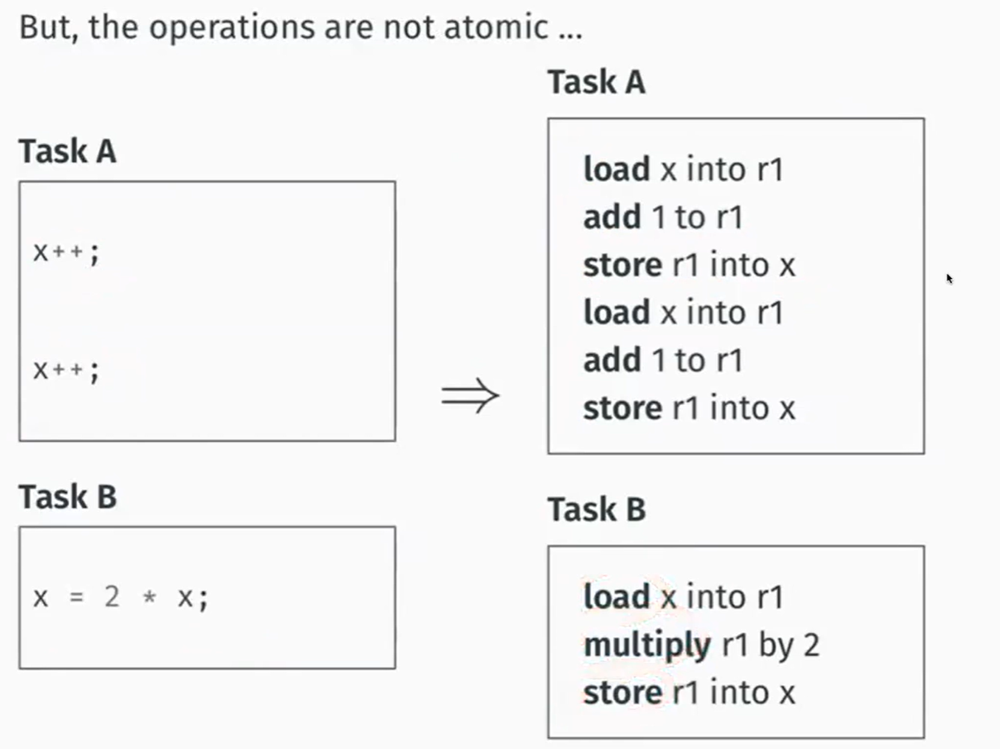
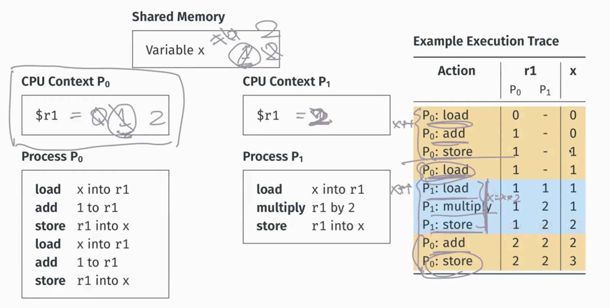

> 参考：
>
> CSAPP Chapter 8 & 12
>
> NUS IT5002 Lec14: Inter-Process Communication

## Race Condition & Critical Section

> [!NOTE]
>
> Race conditions (竞态条件) occur when two or more processes attempt to access shared storage.

来看一个race condition的例子，想要实现的是两个进程都对内存中某个变量进行递增，结果应该是3才好（100是随便取的数：

| process A          | process B          |                               |
| ------------------ | ------------------ | ----------------------------- |
| `lw $t0, 100($s1)` | `lw $t1, 100($s1)` | `mem[100 + $s1] = 1`          |
| `addi $t0, $t0, 1` | `addi $t1, $t1, 1` |                               |
| `sw $t0, 100($s1)` |                    | `mem[100 + $s1] = 2` (A 写回) |
|                    | `sw $t1, 100($s1)` | `mem[100 + $s1] = 2` (B 写回) |

在上面这种情况里，进程A的写入结果被进程B覆盖了，导致进程A所作的递增操作丢失了，因为此处进程B还在用尚未被A更新的`mem[100 + $s1]`进行计算。这样的情况被称为race condition, 其最终结果取决于谁最后执行，先执行的结果会被后来者覆盖住。

看了这个例子，我们就知道，出现竞态条件是很不好的事情，有可能让我们无法得到预期的结果。而在竞态条件下试图预测/控制竞争结果也是没有意义的，因此：some form of coordination is required to **prevent** race conditions，即prevent two processes from reading / writing shared resources at the same time. This is known as a "mutual exclusion", shortened to "mutex".

但是operation不是atomic的：

> [!Note]
>
> 临界区(critical section)：a running process is always in one of tow possible states:
>
> 1. It is performing local computation. 而local意味着只有当前这个process能访问，所以不会触发race condition.
> 2. It is reading / updating global variables. This can lead to race conditions.
>
> When a running process is in the second state, it is within its "critical section".

相应的，被多个线程/进程共享的资源称为临界资源，如前所述，我们想要保证一个时刻最多只有一个进程在执行临界区的代码，换言之，临界资源一个时刻最多只被一个进程所持有。

为此，4 rules must be followed:

- No two processes can simultaneously be in their critical section.
- No assumptions may be made about speeds or number of CPUs.
- No process outside of its critical section can block other processes.
- No process should wait forever to enter its critical section.

> Since processes have separate virtual address spaces, flows that want to communicate with each other must use some kind of explicit *inter-process communication* (IPC) mechanism.

> [!TIP]

> [!CAUTION]

> [!WARNING]

## Implementing Mutex

Mutual Exclusion 是并发编程中的一种机制，确保多个线程或进程在访问共享资源时，同一时间只有一个线程或进程可以访问，从而避免竞态条件的发生。

There are several ways of implementing mutexes, each which their own + and - points.

### disabling interrupts 

### lock variables 

### Peterson's Algorithm

## Semaphore

A semaphore with maximum value 1 is a binary semaphore, which is equivalent to a mutex.
