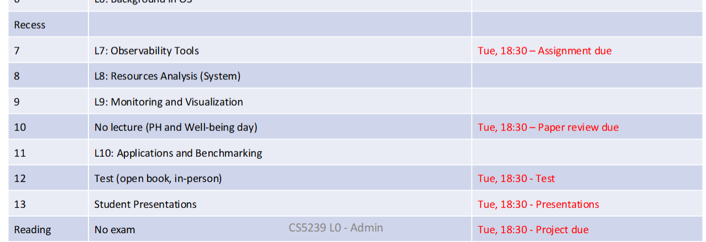
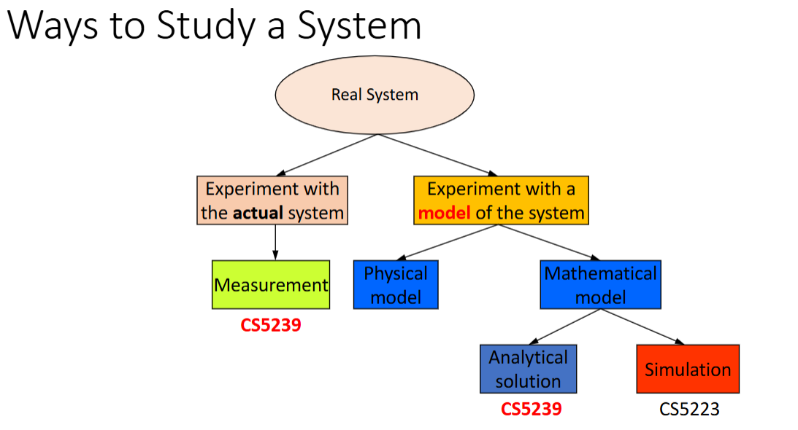
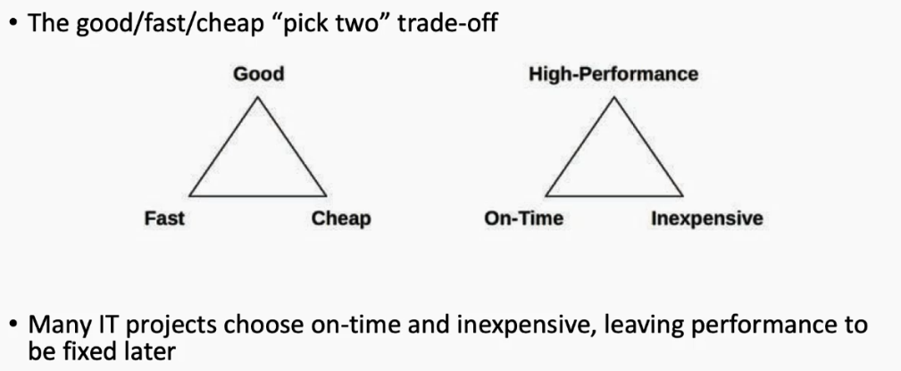
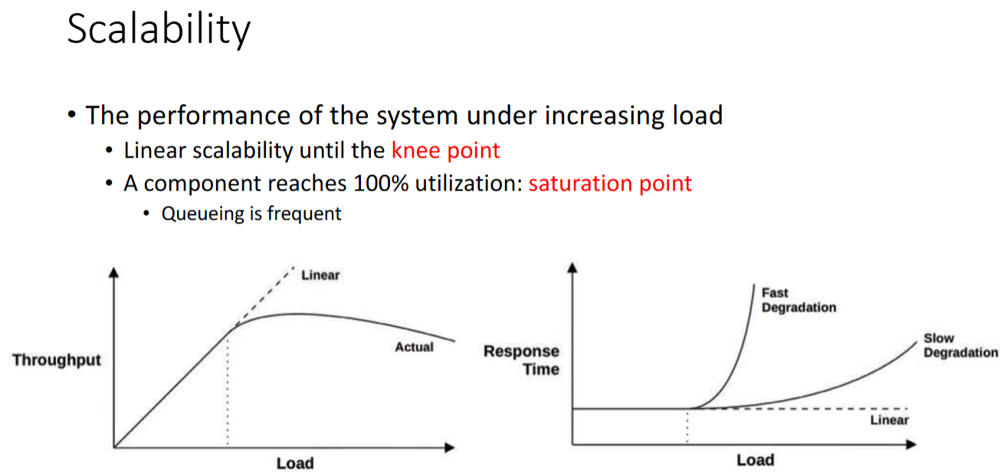
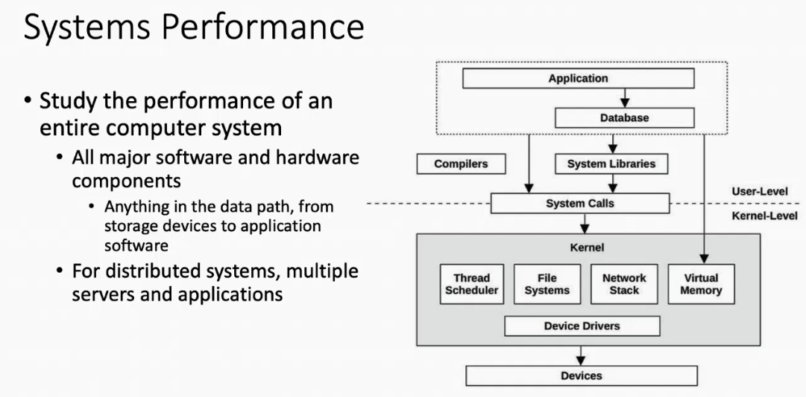

• 20% - Assignment
• 30% - Test

• 10% - Paper review
• 5% - Presentation of the project or paper
• 35% - Project

# What is performance? 

performance-cost ratio

trade-offs

# Performance scope and challenges 

latency

throughput / bandwidth

arrival rate

service rate

# Activities 

life cycle

performance model

capacity planning 

resource footprint

# Latency 

# Observability
