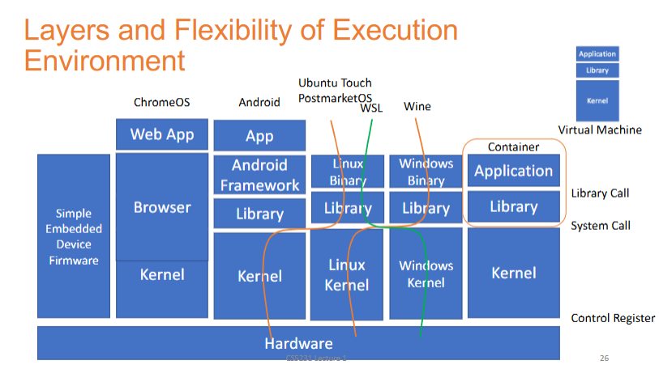
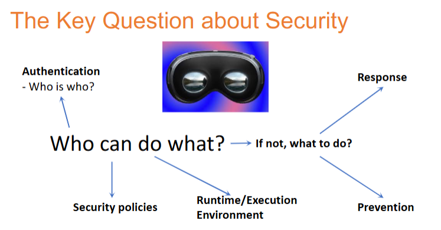

# Target

- (generalized) definition of systems
- principle and practice of system security
- research frontier of systems security

# The Security Problem 

# The Axioms of Security

- Principle of Easiest Penetration

# Methodology

how systems work? -> break system -> how attacks work -> new defense

# Layers and Flexibility of Execution Environment

application talks to library, the library talks to kernel

the library doesn't care whether it's a real kernel or not, as long as they make a system call and the return is as expected, the application can run

cut a line between the kernel and the library, and then transport / replace the kernel with something else, something compatible.

so this is the idea of a container

# The key question about Security

u'll always ask the question, who can do what? 

The recent hot topic is, AI agent. Then,  from the system point of view, if we want to see the system security problems, instead of AI-only problems, we still need to answer this question.

# Our lens from System Angle / Guiding questions:

- what is the runtime platform/code/data
- what are the owners and how to identify them?
- what are the resources to be protected?
- what is considered a security problem?
- what is the nature of the protection mechanism?
  	- access control
  	- isolation
  	- deterrence