# Evolution of Memory Error Attacks and Defenses

## 1. Memory error 

## 2. Advanced 

## 3. Defense

# Lecture 2: System platform and Memory Safety Vulnerabilities in Software Binary

what's the notion of system? a dynamically changing subject. If you are hard-coding your thinking into any particular system, you lose the flexibility.

When things evolve rapidly, one needs a stable frame of reference to truly understand the principles and anticipate future directions.

"参照系"

Probably AI is fast. We need to use AI, we need to embrace AI. But also, we need to look beyond the AI, right? If you zoom, we are turning in the middle of the ways, right? But if you zoom out, AI is just part of the computing history, there's a future better than the AI.

So if you look from that point of view, What is most stable over the years? Exactly, you look from the CPU up. It's very stable. Windows has been there. Linux has been there for many years.

怎么理解systems

it's not a rule, it's actually a demand, you feel the needs, and then you can things flow through the system stack.

## What is a System?

A **platform** supporting program **execution**.

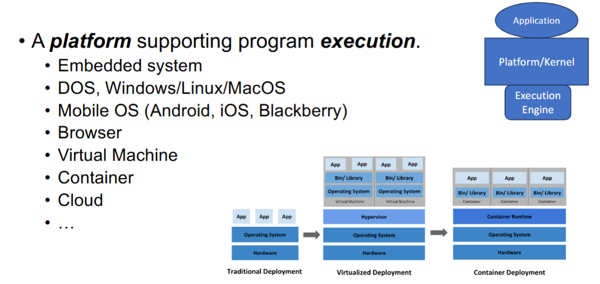

## Execution on CPU (Memory errors)

### Basics:  x86 Machine Model 

In CPU, there are internal memory, which is called registers.

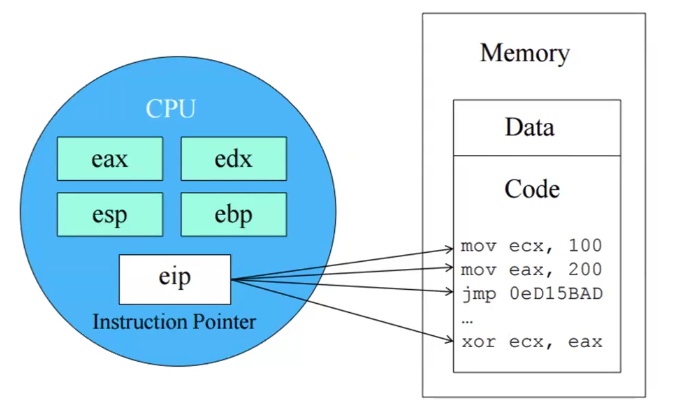

little endian

又回到cs161 好想你 :-(

### Buffer Overflows 

### Buffer Overflow Defense

## x86 calling convention & memory layout

EBP: base pointer, points to top of the current stack frame

ESP: stack pointer, points to lowest item on the stack

EIP: instruction pointer, points to the next instruction to be executed

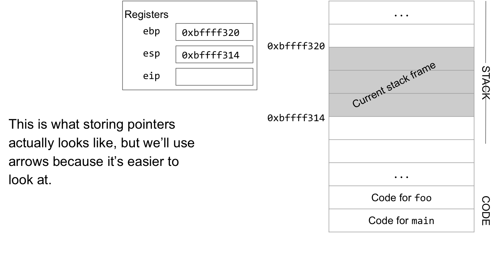

**calling convention**: if we ever overwrite a saved register, we should remember its old value by putting it on the stack.

steps of a function call:

1. push arguments on the stack
2. push old eip (rip) on the stack
3. move eip
4. push old ebp (sfp) on the stack
5. move ebp
6. move esp
7. execute the function
8. move esp
9. restore old ebp (sfp)
10. restore old eip (rip)
11. remove arguments from stack

### 1. Arguments

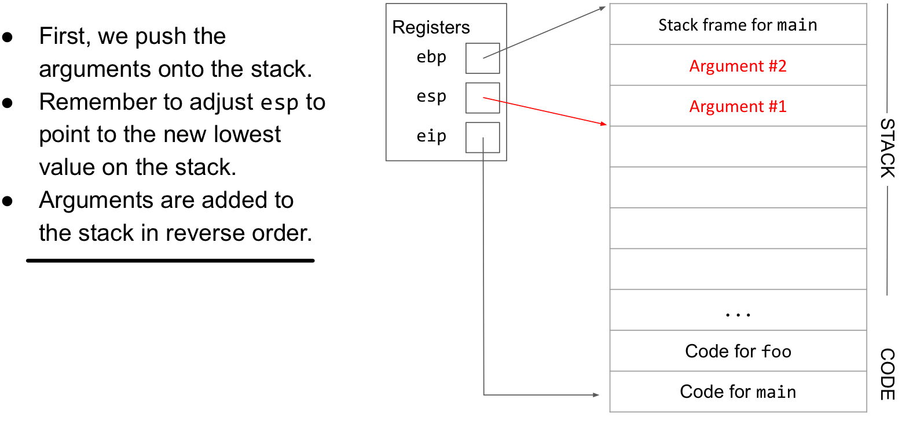

### 2. Remember EIP 

Next, push the current value of EIP on the stack. This value tells us what code to execute next after the function returns, sometimes known as the RIP (return instruction pointer).

Also remember to adjust ESP to point to the new lowest value on the stack.

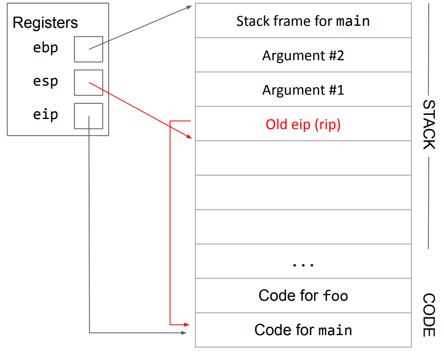

### 3. Remember EBP 

Next, push the current value of EBP on the stack. This will let us restore the top of the previous stack frame when we return. This value is sometimes known as the SFP (saved frame pointer), because it reminds us where the previous frame was.

Remember to adjust ESP to point to the new lowest value on the stack.

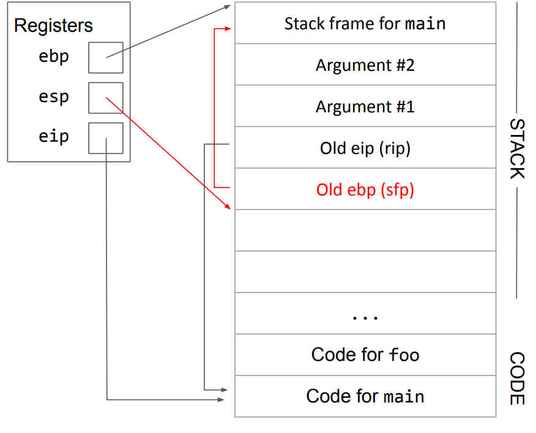

### 4. Adjust the stack frame 

Now, to adjust the stack frame, we need to update all three registers.

We can safely do this because we've just saved the old values of EBP and EIP. ESP will always be the bottom of the stack, so there's no need to save it.

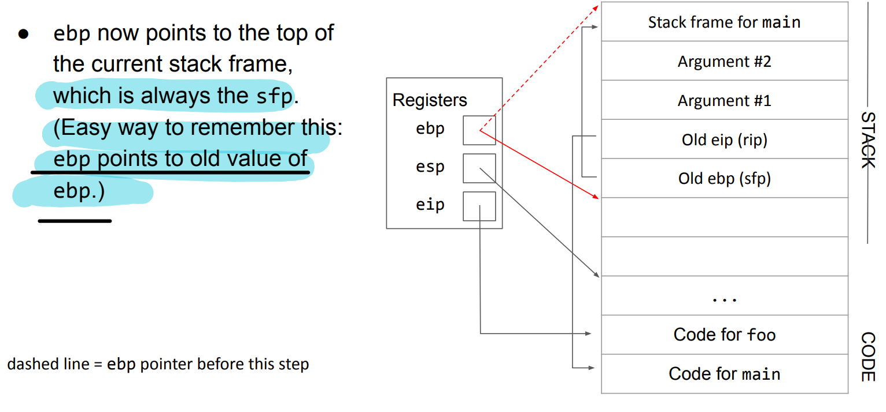

==y？为什么ebp指向旧ebp而不是旧ebp的下一个地址呢==

==为了给新的frame一个固定的参考点 & 方便实现高效的函数清理（function epilogue）==。

首先，`EBP` 指向保存旧 `EBP` 的位置，那么访问**所有**栈帧内的元素就变得非常统一和方便 ：

**访问参数**：参数由调用者压栈，位于 `EBP` 的“上方”（高地址），所以可以通过 **正偏移量** 访问，例如 `[EBP + 8]`、`[EBP + 12]` 。

**访问局部变量**：局部变量在 `EBP` 设置好之后分配，位于 `EBP` 的“下方”（低地址），所以可以通过 **负偏移量** 访问，例如 `[EBP - 4]`、`[EBP - 8]` 。

其次，这个设计使得函数返回时的清理工作变得极其高效。x86 指令集里有一条专门的指令叫 `leave`。

`leave` 指令等价于下面两条指令：

1. `mov esp, ebp`：将 `ESP` 指针直接拉回到 `EBP` 的位置，瞬间释放所有为局部变量分配的栈空间。
2. `pop ebp`：从栈顶（现在 `ESP` 和 `EBP` 指向同一个地方）弹出保存的旧 `EBP` 值，恢复调用者的栈帧。

`leave` 这条指令的设计，完全依赖于 `EBP` 正好指向保存旧 `EBP` 值的位置。如果 `EBP` 指向别处，这条高效的硬件指令就无法使用了，清理工作就必须手动分两步完成，效率更低。

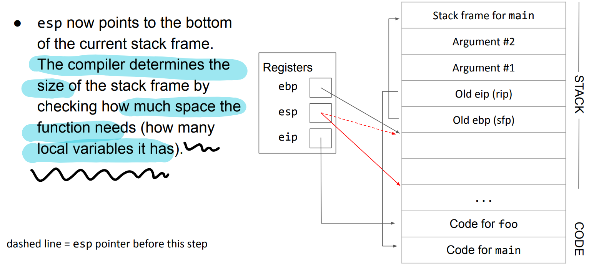

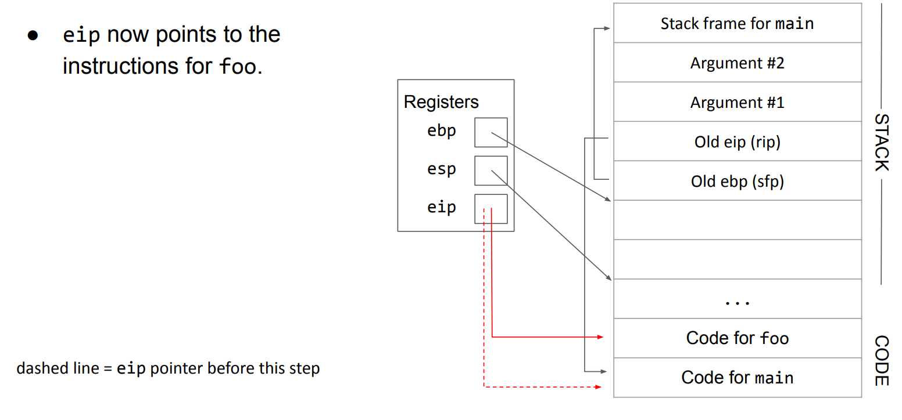

### 5. Execute the function 

Now the stack frame is ready to do whatever the function instructions say to do.

Any local variables can be moved onto the stack now.

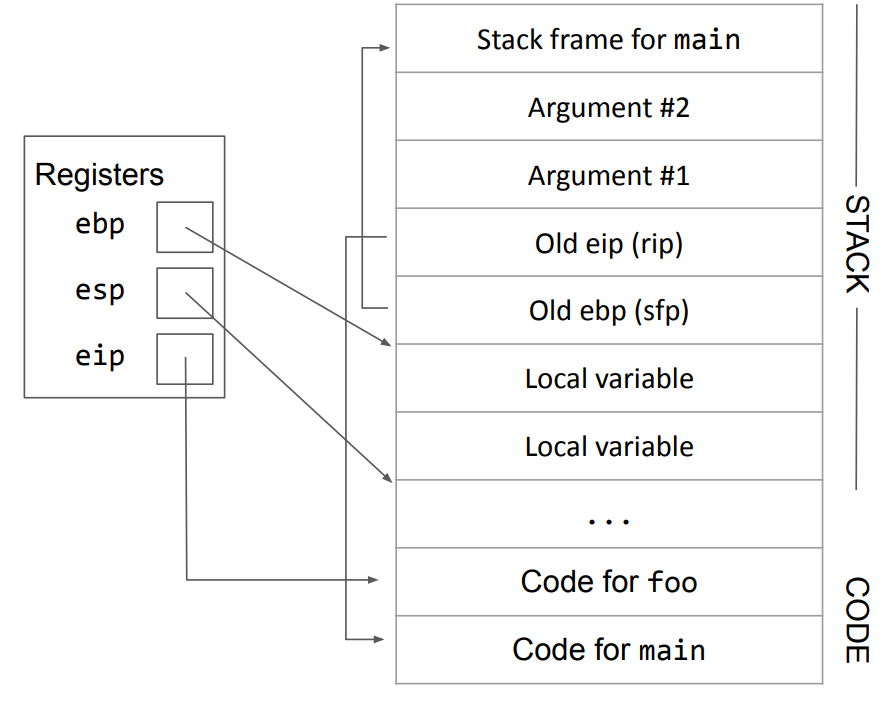

### 6. Restore everything

After the function is finished, we put all three registers back where they were. We use the addresses stored in RIP and SFP to restore EIP and EBP to their old values.

ESP naturally moves back to its old place as we undo all our work, which involves popping values off the stack.

Note that the values we pushed on the stack are still there (we don't overwrite them to save time), but they are below ESP so they cannot be accessed by memory.

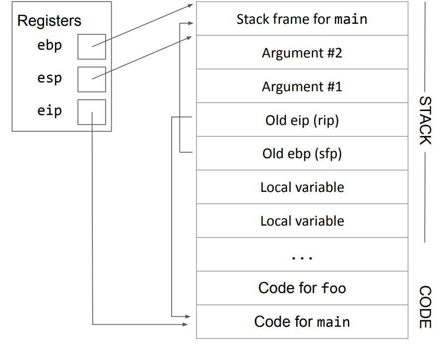
